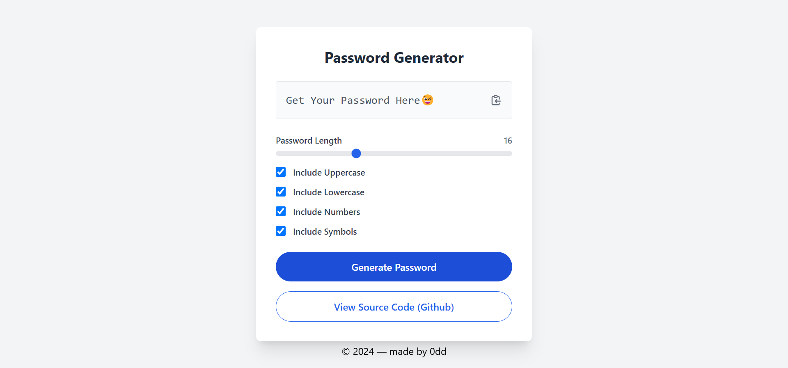

 

 
 

    
    
  

<h3 align="center">Strong Password Generator (Vanilla Js)</h3>

<a href="https://strong-password-gen.web.app/">🌐View live demo🌐</a>

## <a name="introduction">🤖 Introduction</a>

A vanilla JavaScript project that generates strong passwords, using cryptographic randomness, better character selection, and secure password assembly.

## <a name="tech-stack">⚙️ Tech Stack</a>

- HTML 5
- TailwindCSS
- Vanilla JavaScript

## <a name="features">🔋 Features</a>

👉 **Cryptographic Randomness**:

- Uses crypto.getRandomValues() instead of Math.random()
- Implements modulo bias elimination
- Ensures the proper uniform distribution of characters

👉 **Better Character Selection**:

- Implements pre-defined character sets instead of character codes
- Guarantees at least one character of each selected type
- More comprehensive symbol set available

👉 **Secure Password Assembly**:

- Implements the Fisher-Yates shuffle using cryptographic randomness
- No predictable character positioning
- Implements proper handling of required character types

👉 **Additional Stuff**:

- Modern async/await clipboard handling
- Better error handling
- More maintainable character set definitions
- Input validation
